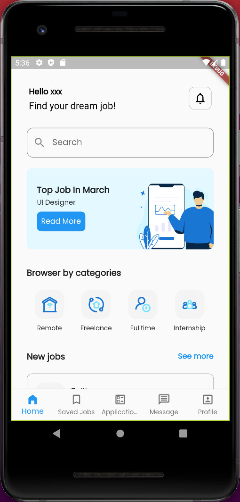
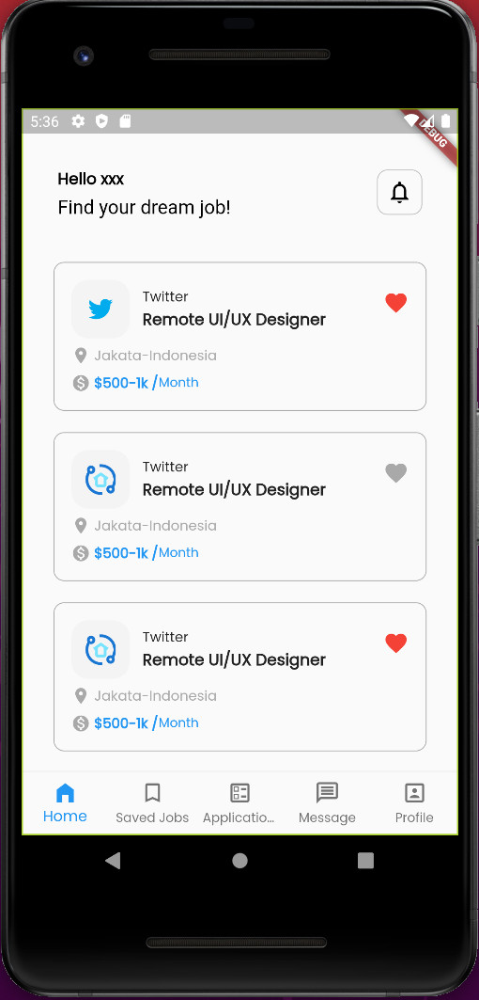
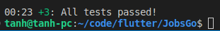
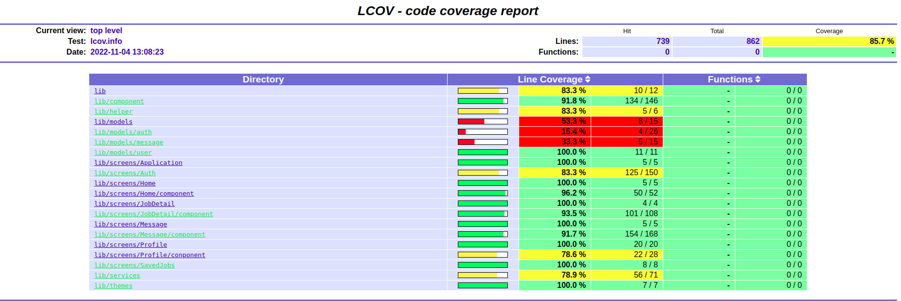

# Group 7 - INT3020 40

### Members

- Le Tuan Anh - 20021287

- Pham Huy Hieu - 20020137

- Do Thi Anh Duong - 20020274

### <a href="https://www.figma.com/file/Dg8RZqQsy4TSgrC1egQ9EL/JobsGO">Figma</a>

### Requirement

```
environment:
  sdk: ">=2.18.0 <3.0.0"
```

### Run

```
flutter run
```

# Report

## Week 3

<details>
  <summary>Home Screen</summary>
  
<table>
<tr>
<td></td>
<td></td>
</tr>
</table>

</details>

## Week 4

<a href="https://temp-data-doc.s3.us-east-2.amazonaws.com/Mobile/Week+4/2022-09-30+10-40-27.gif">Gif demo</a>

<details>
  <summary>Auth Screen</summary>
  
<table>
<tr>
<td></td>
<td></td>
</tr>
</table>

</details>

<details>
  <summary>Message Screen</summary>
  
<table>
<tr>
<td></td>
<td></td>
</tr>
</table>

</details>

## Week 5

<details>
  <summary>Welcome screen</summary>

<table>
<tr>
<td></td>
<td></td>
<td></td>
<td></td>
</tr>
</table>

</details>

<details>
  <summary>Application screens</summary>
  
<table>
<tr>
<td></td>
</tr>
</table>

</details>

<details>
  <summary>SavedJobs screens</summary>
  
<table>
<tr>
<td></td>
</tr>
</table>

</details>

## Week 6

<a href="lib/logs/test_logs.txt">UI/Application Exerciser Monkey</a>

<details>
  <summary>Integration Test</summary>
  
<table>
<tr>
<td></td>
</tr>
</table>

</details>

## Week 7

<a href="lib/logs/test_logs.txt">UI/Application Exerciser Monkey</a>

<details>
  <summary>Integration Test</summary>
  
<table>
<tr>
<td></td>
</tr>
</table>

</details>

<details>
  <summary>Coverage Test</summary>
  
<table>
<tr>
<td></td>
</tr>
</table>

</details>
